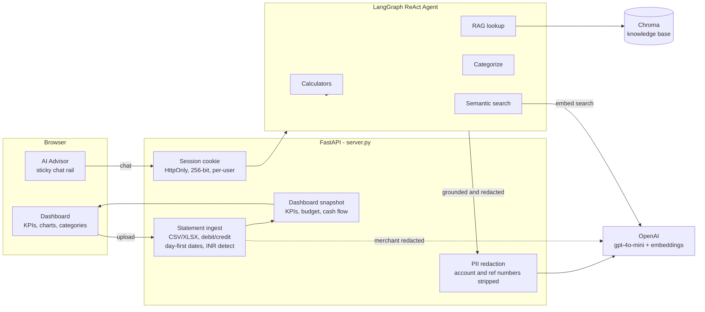

# FinGenius — AI-Powered Personal Finance Advisor


> **Upload your real bank statement → get an instant financial dashboard and chat with an AI advisor grounded in your actual spending.**

FinGenius started life in **2024 as a Gemini-powered Colab notebook** exploring five Gen AI
capabilities. It worked — but it lived inside cells you had to run top to bottom. This
repository is the **rebuild**: the same five capabilities, now wired into a real, deployable
full-stack application with a polished dashboard, a live AI advisor, real bank-statement
parsing, per-user isolation, and PII redaction.

> *From a notebook nobody could use → to a product you open in a browser.*

---

## Launch Video

<div align="center">

[](https://drive.google.com/file/d/1xK6NZLXqlXKR88WmD_cypPduBUR7WM2W/view?usp=sharing)

</div>

> Click to watch on Google Drive. (GitHub can't embed an inline player for Drive videos.)

## Dashboard


---

## What it does

- 📥 **Upload a real bank statement** (CSV or Excel) — it auto-detects the format, skips the
  account-info preamble, handles separate Debit/Credit columns, day-first dates, and
  comma-formatted amounts. Tested against **State Bank of India (SBI)** statements.
- 🏷️ **Automatic categorization** — extracts the merchant/payee from messy UPI strings
  (`WDL TFR UPI/DR/.../Blinkit/...` → **Blinkit**) and categorizes it. Common Indian merchants
  match a **free keyword map**; only unknowns hit the LLM (capped per upload to bound cost).
- 💱 **Currency-aware** — reads the statement's currency (e.g. `INR`) and renders the whole
  dashboard in **₹** with Indian digit grouping.
- 📊 **Live dashboard** — KPIs, cash-flow trend, savings rate, 50/30/20 budget, spending by
  category, and an interactive investment-growth calculator.
- 💬 **AI advisor** — an always-visible chat rail grounded in *your* numbers. Ask
  *"where's my money going?"*, *"what's my biggest expense?"*, *"where can I cut back?"* and it
  answers from your real data, plus does semantic search over your transactions.
- 🔒 **Private & isolated by design** — see [Security & Privacy](#security--privacy).

---

## Architecture



**Flow:** the browser holds only a server-issued session cookie. Uploads are normalized and
categorized server-side, then a snapshot drives the dashboard. The chat grounds a LangGraph
agent in your data and routes everything through a redaction layer before it reaches OpenAI.

---

## The 5 Gen AI Capabilities

All five are wired into the LangGraph agent as callable tools, so the conversational advisor
can reach any of them on demand.

| # | Capability | Implementation | Agent tool |
|---|------------|----------------|------------|
| 1 | **Structured Output** | Pydantic `with_structured_output` → typed `TransactionCategory` | `categorize_transaction` |
| 2 | **RAG** | Chroma vector store over a financial knowledge base | `financial_knowledge_lookup` |
| 3 | **Embeddings** | OpenAI embeddings + cosine similarity over your statement | `find_similar_transactions` |
| 4 | **Function Calling** | 5 financial calculators (budget · emergency fund · debt · investment · loan) | `calculate_*` |
| 5 | **Agents (LangGraph)** | `create_react_agent` + memory, orchestrating all of the above | *(the advisor itself)* |

---

## Tech Stack

| Layer | Technology |
|-------|------------|
| **LLM** | OpenAI `gpt-4o-mini` (configurable) |
| **Agent framework** | LangChain + **LangGraph** (ReAct agent with tool calling + memory) |
| **Embeddings** | OpenAI `text-embedding-3-small` |
| **Vector store** | ChromaDB (`langchain-chroma`) |
| **Backend** | FastAPI + Uvicorn |
| **Data** | pandas · NumPy · scikit-learn · openpyxl |
| **Frontend** | Single-file dashboard (vanilla HTML/CSS/JS, no build step) |

---

## Quick Start

**Prerequisites:** Python 3.10+ and an OpenAI API key.

```bash
# 1. Clone
git clone https://github.com/anujdevsingh/financial_genius_agent.git
cd financial_genius_agent

# 2. Install
pip install -r requirements.txt

# 3. Add your key
cp .env.example .env        # then edit .env and set OPENAI_API_KEY

# 4. Run the dashboard
uvicorn server:app --reload --port 8000
# open http://localhost:8000
```

Click **Upload statement**, pick your bank's CSV/Excel export, and the dashboard + advisor
update to your real data. No upload? It runs on a built-in sample dataset.

Simpler alternatives:

```bash
python main.py        # terminal chat with the agent
streamlit run app.py  # basic Streamlit UI
```

> The first run builds a local Chroma vector store from the knowledge base (cached in `.chroma/`).

---

## Bank Statement Support

The importer is built for **real, messy statements**, not just clean CSVs:

- **Formats:** `.csv`, `.xlsx`, `.xls`
- **Preamble handling:** automatically finds the real transaction table below account-info rows
- **Column aliases:** `Date`/`Transaction Date`, `Narration`/`Particulars`/`Details`,
  `Withdrawal Amt.`/`Deposit Amt.`, `Debit`/`Credit`, `Amount`, …
- **Debit/Credit split** → single signed amount (debit = spend, credit = income)
- **Day-first dates** (`01/03/2026` → 1 March) and **comma amounts** (`1,250.00`)
- **Encoding fallback** (UTF-8 → cp1252 for Windows-exported bank CSVs)
- **UPI/IMPS merchant extraction** + Indian merchant keyword categorization

Minimum required columns: a **date**, a **description**, and either an **amount** or
**debit/credit** columns.

---

## Security & Privacy

This is a public-demo-ready app, so isolation and privacy were designed in:

- 🔑 **Server-issued sessions** — a cryptographically strong (256-bit) **HttpOnly** cookie.
  The server never trusts a client-supplied id, so no one can guess or set another user's
  session. Each visitor's dashboard, chat, and search are fully isolated.
- 🔒 **PII redaction before the LLM** — account numbers, customer/reference IDs, and UPI VPAs
  are stripped from everything sent to OpenAI (chat grounding, categorization, and the
  semantic-search corpus). Merchant names and amounts are kept so advice stays useful; the
  account header is discarded on import and never leaves your machine.
- 🧾 **In-memory only** — uploaded statements live in server RAM keyed to your session, never
  written to disk or a database.

---

## Deployment

The repo includes a `render.yaml` for one-click [Render](https://render.com) deploys:

1. Push to GitHub and create a Render **Blueprint** from the repo.
2. Set `OPENAI_API_KEY` as an environment variable in the Render dashboard.
3. Deploy → you get a public `https://…onrender.com` URL.

> **No login = your API key pays for every visitor.** Before exposing it publicly, set a
> **hard spending limit** on your OpenAI account. For a portfolio, the launch video + this
> repo are the always-on showcase; bring the live demo up on demand.

---

## Project Structure

```
financial_genius_agent/
├── fingenius/                 # Application package
│   ├── config.py             # Model config + LLM/embedding factories
│   ├── privacy.py            # PII redaction before any LLM call
│   ├── data/                 # Sample transactions + financial knowledge base
│   ├── analysis/             # Categorization (structured output) + embeddings
│   ├── rag/                  # Chroma knowledge base + retriever
│   ├── tools/                # Agent tools: 5 calculators, RAG lookup,
│   │                         #   categorize, per-session semantic search
│   ├── dashboard.py          # KPIs / budget / cash flow snapshot (+ advisor grounding)
│   └── agent/                # LangGraph conversational advisor (graph.py)
├── server.py                 # FastAPI server: sessions, upload, dashboard, chat
├── web/index.html            # Single-file dashboard + AI chat rail
├── main.py                   # CLI chat entry point
├── app.py                    # Streamlit UI
├── render.yaml               # One-click deploy config
├── requirements.txt
├── .env.example
└── fingenius-notebook-gemini-agent.ipynb   # Original Colab notebook (the origin story)
```

---

## Origin: the notebook

The original **`fingenius-notebook-gemini-agent.ipynb`** is kept in the repo as the project's
starting point — a Gemini-based walkthrough of the five Gen AI capabilities. Everything in
`fingenius/` is the productionized rebuild of those ideas on an OpenAI + LangGraph stack.

---

## License

MIT — see [LICENSE](LICENSE).

## Author

<div align="center">

### **Anuj Dev Singh**
*AI/ML Enthusiast · Data Science Student · Gen AI Developer*

*"Bridging the gap between advanced AI and practical financial tools for everyone."*

</div>
